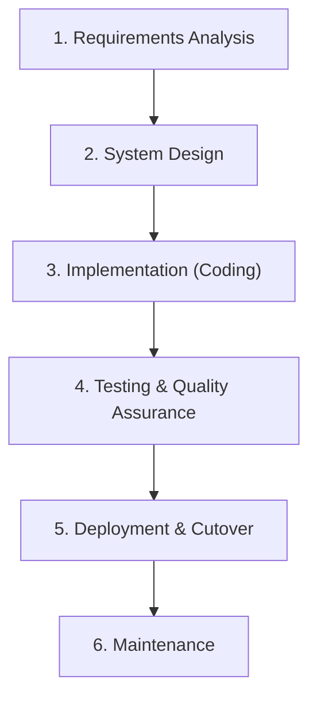
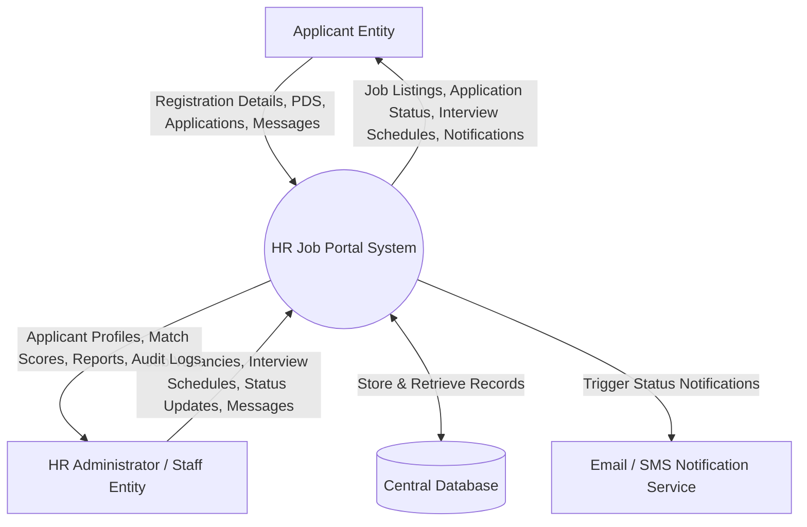
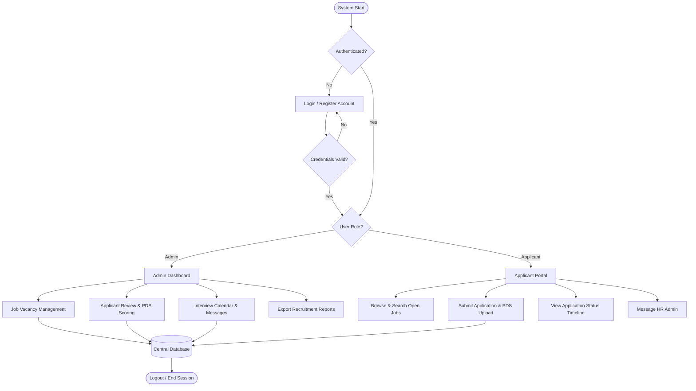
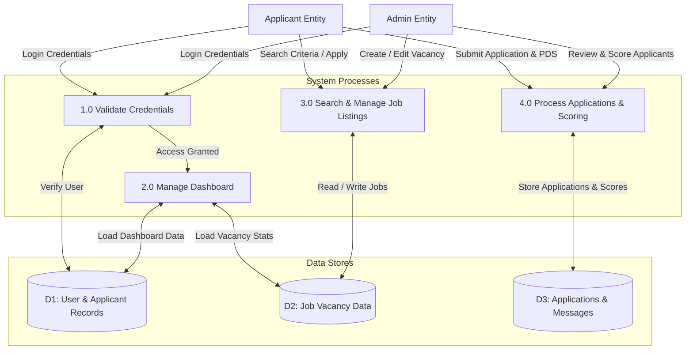
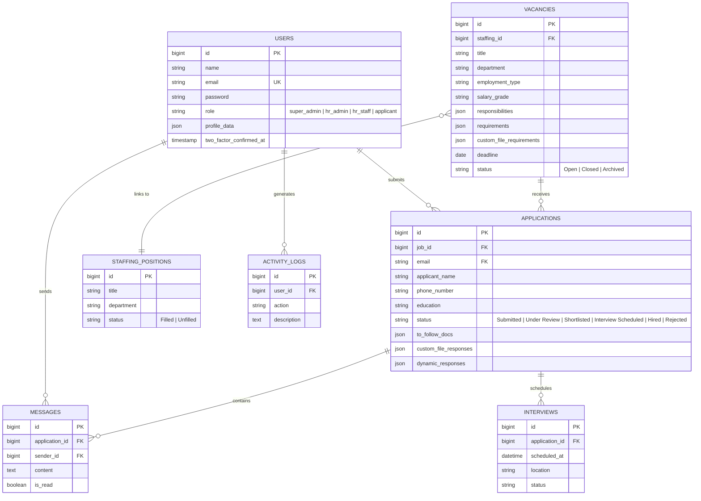

# Chapter 3: TECHNICAL BACKGROUND & METHODOLOGY

**HUMAN RESOURCE DEPARTMENT WEB-BASED JOB PORTAL SYSTEM FOR NATIONAL AVIATION ACADEMY OF THE PHILIPPINES**

**Authors:** ALARCIO, CHARLES JOHN S. & CACACHO, MARCUS ANGELO T.  
**Adviser:** Alan Lino Silverio J. Agustin, DAEM.  
**Institution:** Institute of Computer Studies, National Aviation Academy of the Philippines (Piccio Garden, Villamor, Pasay City)  
**Degree:** Bachelor of Science in Information Technology with Specialization in Aviation Information Technology  

---

This chapter explains how the researchers developed the Human Resource Department Web-Based Job Portal System for the National Aviation Academy of the Philippines (NAAP). It describes the process of planning, designing, building, and testing the system to improve the recruitment process. The system is web-based and allows HR personnel to post job vacancies, manage applications, and track applicants. At the same time, applicants can register, apply for jobs, and monitor their application status online. The goal of the system is to make recruitment faster, more organized, and easier for both HR staff and applicants.

This chapter also discusses the tools and technologies used, as well as how data is stored, processed, and displayed in the system. It explains how the system was designed to be user-friendly, secure, and efficient. Overall, this process helped the researchers develop a functional and reliable system that improves the hiring process and can be enhanced in the future.

---

## 3.1 Research and Development Methodology

The development of this project methodology is to design and develop the Human Resource Department Web-Based Job Portal System for NAAP. This method focuses on creating a system that improves the current recruitment process. It follows a step-by-step approach including requirements analysis, system design, development, testing, and deployment to ensure the system is functional and effective.

### 3.1.1 Software Development Life Cycle (SDLC) Methodology

The study followed the Software Development Life Cycle (SDLC) using the **Waterfall Model**. This model follows a sequential process where each phase is completed before moving to the next. The phases include planning, analysis, design, development, testing, and deployment. This approach helps ensure that the system is well-organized, properly developed, and meets the required objectives.



### 3.1.2 System Development Timeline (Gantt Chart)

The development timeline of the Human Resource Department Web-Based Job Portal System for NAAP spans from **December 2025 to April 2026**:

1. **Finding Client (Dec 2025):** Identifying project stakeholders at NAAP Villamor Air Base campus and gathering initial requirements.
2. **Proposal / Title Approval (Dec 2025):** Formal approval of the capstone project study and defining system scope.
3. **Chapter 1 to 3 Writing (Jan – Mid-Feb 2026):** Formulating introduction, review of literature, technical background, and methodology.
4. **System Design (Feb 2026):** Constructing System Architecture, DFD Level 0, DFD Level 1, ERD, and UI Wireframes.
5. **System Development / Coding (Mid-Feb – Mar 2026):** Full-stack web development using Laravel 11 backend, React 19/Inertia.js frontend, and MySQL database.
6. **Defense Preparation (Apr 2026):** System testing, UAT, documentation finalization, and presentation defense.

---

## 3.2 System Analysis and Feasibility

### 3.2.1 System Development Framework

The current recruitment process of the Human Resource Department of NAAP is primarily conducted through manual and semi-digital methods. Job vacancies are announced via physical bulletin boards or email, and applicants submit physical documents or emails. HR personnel manually review submitted applications, organize records, and track hiring progress using spreadsheets or paper files.

### 3.2.2 Limitation and Requirement Gap Analysis

1. **Lack of Centralized Platform:** Scattered data across physical files and email threads makes record retrieval slow and prone to loss.
2. **Time-Consuming Manual Sorting:** Manual verification of Personal Data Sheets (PDS) and credentials increases HR workload and prolongs time-to-hire.
3. **Human Error Vulnerability:** Risk of misplaced documents, duplicate entries, and incorrect data recording.
4. **Limited Applicant Visibility:** Applicants cannot check real-time application status, leading to frequent follow-up inquiries.
5. **Lack of Real-Time Communication & Security Concerns:** Insecure transmission of sensitive personal documents without standardized access control.

### 3.2.3 Alternative Solution Analysis

- **Alternative A (Enhancement of Existing Manual System):** Rejected. Retains manual data entry, human error vulnerabilities, and lack of real-time tracking.
- **Alternative B (Third-Party Commercial ATS):** Rejected. Cost-prohibitive recurring subscription fees, lack of customization for aviation/civil service requirements, and third-party data privacy risks.
- **Alternative C (Custom Web-Based Job Portal System – Selected Solution):** Selected. Directly addresses institutional bottlenecks, provides centralized database storage, automates applicant tracking, and ensures data privacy compliance under institutional control.

### 3.2.4 Proposed Technology Alternatives

1. **Centralized Database Management System:** Consolidates all applicant records, job postings, and recruitment data into a single platform to eliminate scattered files.
2. **Automated Application Tracking and Notification System:** Automatically updates application statuses and sends notifications to applicants regarding their progress.
3. **Search and Filter Optimization:** Integrated filtering and search functionality allowing HR personnel to quickly locate applicants based on qualifications and job positions.

### 3.2.5 Feasibility Study

- **Technical Feasibility:** Highly feasible using standard web stack (PHP 8.2+, Laravel 11, React 19, Inertia.js, MySQL/SQLite, Tailwind CSS, Vite) running on standard web hosting servers.
- **Operational Feasibility:** Aligns directly with NAAP HR workflows, offering simple role-based interfaces for applicants and HR staff with minimal training required.
- **Economic Feasibility:** Built on open-source frameworks without software licensing fees. Yields positive 3-year ROI (81.2%) and Benefit-Cost Ratio (1.81:1).
- **Schedule Feasibility:** Successfully scheduled and completed within the academic timeline (December 2025 to April 2026).

---

## 3.3 Cost-Benefit Analysis

### 3.3.1 Labor Rates Assumption

| Role | Hourly Rate (₱) |
| :--- | :--- |
| **Project Manager** | ₱550 |
| **Developer / Programmer** | ₱550 |
| **System Analyst** | ₱550 |
| **UI/UX Designer** | ₱400 |
| **QA / Test Specialist** | ₱350 |

### 3.3.2 Total Development Cost Breakdown

| Phase | Description | Cost (₱) |
| :--- | :--- | :--- |
| **Phase 1** | Requirement Analysis | ₱11,550 |
| **Phase 2** | System Design (Architecture, DFD, ERD, Wireframing) | ₱22,500 |
| **Phase 3** | Implementation (Coding & RBAC Integration) | ₱44,950 |
| **Phase 4** | Testing and Integration | ₱17,000 |
| **Phase 5** | Deployment & Server Setup | ₱16,681 |
| **Phase 6** | Maintenance & Monitoring | ₱7,600 |
| **Total Project Cost** | **Overall Waterfall Development** | **₱120,281** |

### 3.3.3 3-Year Operational Cost Projection

| Category | Description | Estimated Cost (₱) |
| :--- | :--- | :--- |
| **Hardware** | Existing NAAP Workstation Infrastructure | ₱0 |
| **Software** | SSL Certificate, Web Hosting, Domain, & Cloud Backups | ₱30,000 |
| **Labor** | System Administration & Database Maintenance | ₱45,000 |
| **Miscellaneous**| Utilities & Documentation Materials | ₱5,000 |
| **Total Projected Budget** | **3-Year Operational Cost** | **₱80,000** |

### 3.3.4 Financial Summary & Return on Investment (ROI)

| Financial Metric | Amount (₱) / Ratio |
| :--- | :--- |
| **Total Project Cost (3 Years)** | ₱80,000 |
| **Tangible Benefits (3 Years)** | ₱144,960 |
| **Net Benefits (3 Years)** | ₱64,960 |
| **Return on Investment (ROI)** | **81.2%** |
| **Benefit-Cost Ratio (BCR)** | **1.81 : 1** |

---

## 3.4 System Requirements Specification (SRS)

### 3.4.1 Stakeholder Identification and User Roles

1. **Admin (HR Administrator & HR Staff):** Full administrative control over vacancy creation, credential review, applicant match score evaluation, status progression, interview calendar management, real-time applicant messaging, and report export.
2. **Applicant (Job Seekers):** Public job search, account registration, profile setup, PDS data entry, document upload (PDF/DOCX), application tracking, and direct communication with HR.

### 3.4.2 Functional Requirements Matrix

| Ref ID | Module | Functional Description |
| :--- | :--- | :--- |
| **FR-01** | **Authentication** | User account registration, email verification, login, and Two-Factor Authentication (2FA). |
| **FR-02** | **Job Posting** | HR admin creation, modification, closing, and deletion of job vacancies and custom requirements. |
| **FR-03** | **Application Submission** | Applicants fill digital forms, submit PDS parameters, and upload PDF/DOCX attachments. |
| **FR-04** | **Status Tracking** | Real-time monitoring of application stages (*Submitted*, *Under Review*, *Shortlisted*, *Interview Scheduled*, *Hired*, *Rejected*). |
| **FR-05** | **Applicant Management** | HR filtering, sorting, evaluation, PDS match scoring (0–100%), and status progression. |
| **FR-06** | **Messaging & Schedule** | Two-way messaging between HR and applicants, plus calendar interview scheduling. |
| **FR-07** | **Reports & Audit** | CSV/Excel report generation and security activity logging. |

### 3.4.3 Non-Functional Requirements

- **Security:** Password hashing (Bcrypt), session protection, input sanitization, Role-Based Access Control (RBAC), and 2FA option.
- **Usability:** Responsive design built with React 19 and Tailwind CSS, maintaining accessibility across mobile, tablet, and desktop viewports.
- **Performance Efficiency:** Client-side page navigation within **< 1.5 seconds** using Inertia.js props evaluation without reloading the page.
- **Reliability & Maintainability:** Relational schema integrity with foreign keys, soft fallbacks, and modular MVC architecture.

---

## 3.5 Proposed System Architecture & Design

### 3.5.1 Three-Tier System Architecture

```mermaid
graph TD
    subgraph Tier 1: Presentation Layer
        UI["React 19 / Inertia.js Single Page Application"]
        Tailwind["Tailwind CSS & Radix UI Layouts"]
    end

    subgraph Tier 2: Application Layer (Backend Processing)
        Laravel["Laravel 11 Kernel & Controllers"]
        RBAC["Role-Based Access Control Middleware"]
        ScoreEngine["PDS Qualification Scoring Module"]
        AuthEngine["Fortify Auth & 2FA Engine"]
    end

    subgraph Tier 3: Data Layer
        DB[("MySQL / SQLite Relational Database")]
        Storage["File Storage API (Resumes, PDS, Attachments)"]
    end

    UI <-->|"JSON Props over HTTP/XHR"| Laravel
    Laravel --> RBAC
    Laravel --> AuthEngine
    Laravel --> ScoreEngine
    Laravel <-->|"Eloquent ORM"| DB
    Laravel <-->|"Storage Manager"| Storage
```

### 3.5.2 System Components and Modules

1. **User Authentication Module:** Handles secure registration, credential validation, session handling, and 2FA for applicants and administrators.
2. **Job Posting Management Module:** Enables HR administrators to create, edit, close, and manage open job vacancies and dynamic application criteria.
3. **Application Submission Module:** Allows applicants to select open jobs, complete online forms, attach Personal Data Sheets (PDS), and upload required documents.
4. **Application Status Tracking Module:** Displays real-time application updates (*Submitted*, *Under Review*, *Shortlisted*, *Interview Scheduled*, *Hired*, *Rejected*) to applicants.
5. **Applicant Management Module:** Enables HR staff to filter, evaluate, rank via PDS match scores, and update applicant statuses.
6. **Admin Dashboard Module:** Serves as the central command hub displaying unfilled staffing counts, applicant volume statistics, and active vacancies.
7. **Report Generation Module:** Generates and exports downloadable CSV/Excel summary reports for HR decision-making.
8. **Database Management Module:** Stores and manages user profiles, job listings, application histories, and audit activity logs.

---

## 3.6 Data Flow Diagrams (DFD) & System Flowcharts

### 3.6.1 Context Diagram (DFD Level 0 - Figure 3 & Figure 5)



### 3.6.2 System Flowchart (Figure 4)



### 3.6.3 DFD Level 1 (Figure 6)



---

## 3.7 Entity Relationship Diagram (ERD - Figure 7)


