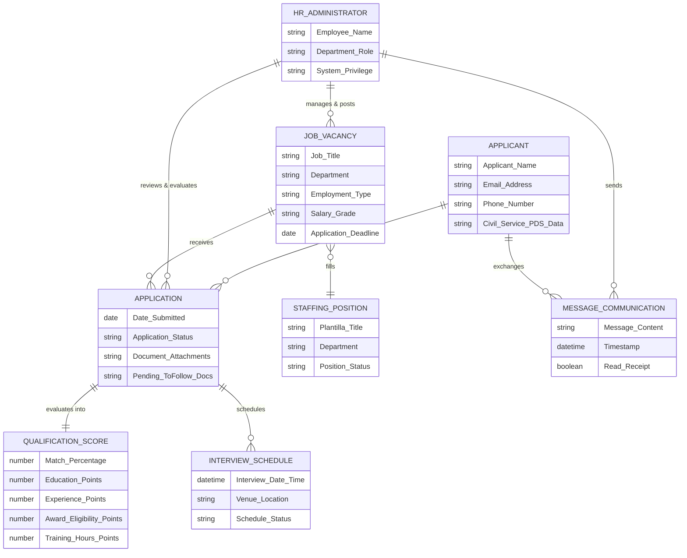

# CONCEPTUAL DATA MODEL

**System Title:** Human Resource Department Web-Based Job Portal System for National Aviation Academy of the Philippines (NAAP)  
**Authors:** ALARCIO, CHARLES JOHN S. & CACACHO, MARCUS ANGELO T.  

---

## 1. Overview of Conceptual Data Model

The **Conceptual Data Model** provides a high-level, business-oriented view of the data requirements for the NAAP Job Portal System. Unlike physical or logical database schemas, the conceptual model focuses purely on high-level domain entities, core business concepts, and the semantic relationships between them without technical database details (such as data types, primary/foreign keys, or table constraints).

---

## 2. Conceptual Entity Relationship Diagram (ERD)

---

## 3. High-Level Entity Descriptions

1. **APPLICANT:** Represents job seekers applying for non-academic positions at NAAP. Holds personal identification details, contact numbers, and submitted Civil Service Personal Data Sheet (PDS) entries.
2. **HR ADMINISTRATOR:** Represents HR personnel (HR Staff, HR Admin, Super Admin) at the Villamor Air Base campus responsible for managing recruitment, creating job postings, reviewing applicant filings, and updating hiring statuses.
3. **JOB VACANCY:** Represents open non-academic employment positions created by HR administrators specifying job specifications, institutional department, employment type, salary grade, and application deadlines.
4. **APPLICATION:** Represents an active job application submitted by an applicant for a specific job vacancy, tracking document attachments, missing *To-Follow* files, and application progress stages (*Submitted*, *Under Review*, *Shortlisted*, *Interview Scheduled*, *Hired*, *Rejected*).
5. **QUALIFICATION SCORE:** Represents the automated PDS match scoring result (0–100%) calculated across Education Level, Years of Experience, Awards/Eligibility, Training Hours, and Document Completeness.
6. **INTERVIEW SCHEDULE:** Represents candidate interview appointments scheduled by HR administrators specifying interview timestamps, location/meeting link, and status.
7. **STAFFING POSITION:** Represents institutional plantilla positions monitored to ensure open vacancies align with authorized filled vs. unfilled quotas.
8. **MESSAGE COMMUNICATION:** Represents direct two-way messages and notification alerts exchanged between HR administrators and job applicants regarding application requirements.
