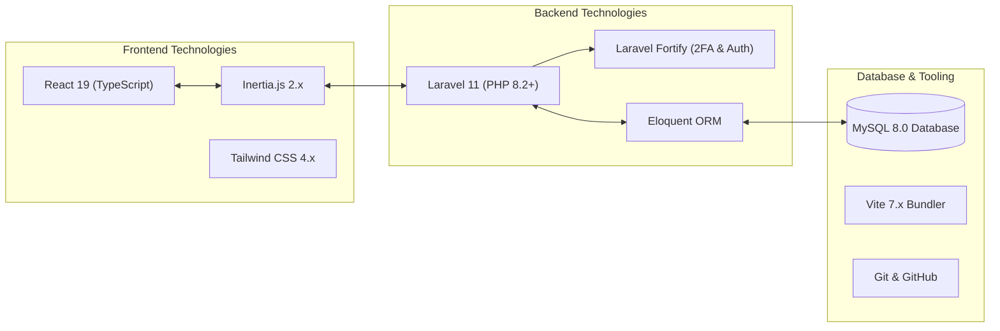
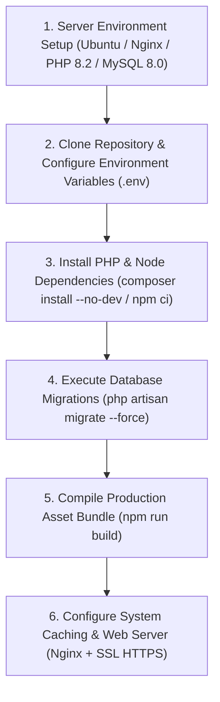

# HARDWARE REQUIREMENTS, DEVELOPMENT TOOLS, AND DEPLOYMENT ENVIRONMENT

---

## 1. Hardware Requirements

To ensure the system can be developed, tested, and deployed efficiently, specific hardware specifications were established for both the **Development Workstation Environment** and the **Target Production Server Environment**. The system requires minimal hardware resources, making it cost-effective and compatible with existing NAAP IT workstation infrastructure.

### 1.1 Development Workstation Environment
The hardware configuration used by the development team (Alarcio & Cacacho) during the planning, coding, database modeling, and local testing phases:

| Hardware Component | Minimum Requirement | Recommended Specification (Actual Dev Rig) |
| :--- | :--- | :--- |
| **Processor (CPU)** | Intel Core i3 (10th Gen) / AMD Ryzen 3 | Intel Core i5 (11th Gen+) / AMD Ryzen 5 (3.0 GHz+) |
| **Memory (RAM)** | 8 GB DDR4 | 16 GB DDR4 RAM |
| **Storage** | 256 GB Solid State Drive (SSD) | 512 GB NVMe M.2 SSD |
| **Display / Monitor** | 1366 x 768 Resolution | 1920 x 1080 Full HD Monitor |
| **Network Interface** | Wi-Fi / Ethernet 100 Mbps | Gigabit Ethernet / Wi-Fi 5 |
| **Peripherals** | Standard Keyboard, Mouse | Standard Keyboard, Mouse |

### 1.2 Target Production Server Environment
The minimum server hardware requirements recommended for deploying the NAAP Job Portal on the institutional cloud or local server at the Villamor Air Base campus:

| Hardware Component | Minimum Server Spec | Recommended Server Spec |
| :--- | :--- | :--- |
| **Cloud / Virtual CPU** | 2 vCPU Cores | 4 vCPU Cores |
| **System Memory (RAM)** | 4 GB RAM | 8 GB DDR4 RAM |
| **Disk Storage** | 40 GB SSD Storage | 100 GB NVMe SSD (for PDF/DOCX attachments & backups) |
| **Bandwidth / Uplink** | 10 Mbps Dedicated Link | 100 Mbps High-Speed Cloud Bandwidth |
| **Backup Storage** | External 50 GB Backup Volume | Offsite Daily Backup Storage Volume |

---

## 2. Development Tools and Programming Technologies

The system is developed using a modern **Three-Tier Monolithic Client-Server Architecture** utilizing open-source web technologies to eliminate licensing costs while ensuring high performance, security, and scalability.

### 2.1 Backend Programming Language & Framework
- **PHP 8.2+**: The core server-side scripting language handling business logic, form validation, file parsing, and authentication.
- **Laravel 11.x**: The primary open-source PHP framework providing MVC structure, Eloquent Object-Relational Mapping (ORM), route management, database migrations, middleware security, and mail services.
- **Laravel Fortify**: Headless authentication library powering user registration, login throttling, password hashing (Bcrypt), session management, and Two-Factor Authentication (2FA).

### 2.2 Frontend Framework & Styling Libraries
- **React 19.x**: A component-based JavaScript library used to build a dynamic, interactive user interface for applicants and HR administrators.
- **TypeScript**: Adds strict typing to JavaScript, reducing runtime errors and improving code quality.
- **Inertia.js 2.x**: Acts as the "bridge" connecting Laravel controllers directly to React frontend components without building a separate REST API, delivering a fast Single-Page Application (SPA) experience.
- **Tailwind CSS 4.x & Radix UI**: Utility-first CSS framework combined with accessible, unstyled UI primitives (dialogs, dropdowns, tabs, modals) for responsive styling across mobile, tablet, and desktop devices.
- **Recharts**: Data visualization library used on the Admin Dashboard to render interactive charts for applicant volumes, score distributions, and department statistics.
- **Lucide React Icons**: Vector iconography library for intuitive visual navigation.

### 2.3 Database Management System
- **MySQL 8.0**: Relational Database Management System (RDBMS) used for structured data storage (users, vacancies, applications, messages, interviews, staffing positions, and activity logs).
- **SQLite**: Lightweight zero-configuration file database used for local unit testing and quick environment bootstrap.

### 2.4 Build Tools, Utilities, and Environment Software
- **Vite 7.x**: High-performance frontend build bundler and asset compiler supporting Hot Module Replacement (HMR) and production asset minification (`npm run build`).
- **Composer**: PHP package dependency manager for Laravel modules.
- **Node.js (v20+) & NPM**: JavaScript runtime and package manager for frontend dependencies.
- **Git & GitHub**: Version control system used for collaborative code management, branch tracking, and backup.
- **XAMPP / Herd / Nginx**: Local web server environment running Apache/Nginx, PHP, and MySQL.

---

## 3. Deployment Environment

The deployment environment outlines the infrastructure, server stack, and operational procedures required to publish the **NAAP Job Portal System** for live use by HR personnel and job applicants.

### 3.1 Web Server Infrastructure
- **Operating System:** Ubuntu 22.04 LTS (Long Term Support) Server Edition / Windows Server 2022.
- **Web Server Software:** **Nginx 1.24+** (configured as a reverse proxy with FastCGI process manager `php-fpm 8.2`) or Apache 2.4+.
- **Domain & Domain Name System (DNS):** Hosted under NAAP’s official domain/subdomain (e.g., `https://careers.naap.edu.ph` or local institutional intranet IP at Villamor Air Base campus).
- **SSL/TLS Encryption:** Transport Layer Security (TLS 1.3 / SSL) certificate via **Let's Encrypt** enforcing mandatory HTTPS encryption for all traffic to protect sensitive applicant credentials and Personal Data Sheet (PDS) attachments.

### 3.2 Production Deployment Workflow

1. **Environment Configuration (`.env` file):**
   - Setting production variables (`APP_ENV=production`, `APP_DEBUG=false`, `APP_URL=https://careers.naap.edu.ph`).
   - Configuring secure database connection parameters (`DB_CONNECTION=mysql`, `DB_HOST`, `DB_DATABASE`, `DB_USERNAME`, `DB_PASSWORD`).
   - Setting session domain, mail server credentials (SMTP), and encryption keys (`php artisan key:generate`).

2. **Database Migration & Seeding:**
   - Executing `php artisan migrate --force` to create production table schemas (`users`, `vacancies`, `applications`, `messages`, `interviews`, `staffing_positions`, `activity_logs`, `cms_contents`, `calendar_events`).
   - Running optional initial seeding (`php artisan db:seed`) to create default HR Admin accounts and plantilla staffing positions.

3. **Frontend Asset Compilation:**
   - Running `npm run build` via Vite to generate minified, production-ready static bundles in the `public/build` directory for fast asset delivery (< 1.5s load times).

4. **File Storage & Security Controls:**
   - Executing `php artisan storage:link` to create a symbolic link from `storage/app/public` to `public/storage`.
   - Setting proper folder permissions (`chmod -R 775 storage bootstrap/cache`) to ensure secure document upload handling.
   - Enforcing Role-Based Access Control (RBAC) middleware and HTTPS redirection to shield sensitive candidate files from unauthorized access under the Philippines Data Privacy Act of 2012 (RA 10173).
