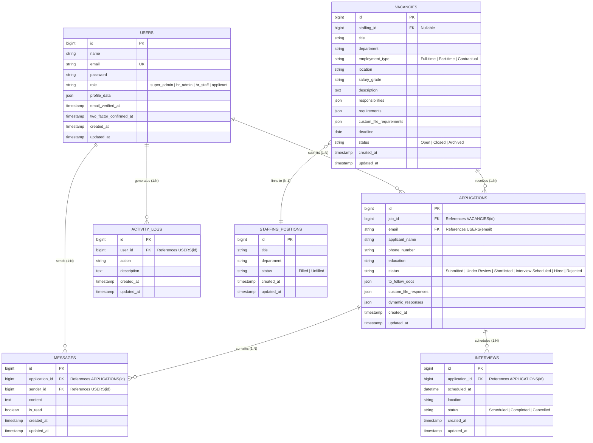

# LOGICAL DATABASE DESIGN

**System Title:** Human Resource Department Web-Based Job Portal System for National Aviation Academy of the Philippines (NAAP)  
**Authors:** ALARCIO, CHARLES JOHN S. & CACACHO, MARCUS ANGELO T.  

---

## 1. Overview of Logical Database Design

The Logical Database Design presents the structured data model for the NAAP Applicant Portal System. It defines entities, attributes, primary keys (PK), foreign keys (FK), data types, constraints, and entity relationships. The schema is normalized to **Third Normal Form (3NF)** to eliminate data redundancy, prevent update anomalies, and ensure referential integrity across all recruitment workflows.

---

## 2. Logical Entity Relationship Diagram (ERD)

---

## 3. Relational Schema Data Dictionary

### 3.1 Entity: `USERS`
Stores user authentication credentials, role privileges, profile parameters, and security attributes.

| Attribute Name | Data Type | Key Type | Nullable | Description / Constraint |
| :--- | :--- | :--- | :--- | :--- |
| `id` | BIGINT (Unsigned) | PK | No | Auto-incrementing unique user ID |
| `name` | VARCHAR(255) | None | No | Full name of the user |
| `email` | VARCHAR(255) | Unique | No | Primary email address (used for authentication) |
| `password` | VARCHAR(255) | None | No | Bcrypt hashed password |
| `role` | ENUM | None | No | Values: `'super_admin'`, `'hr_admin'`, `'hr_staff'`, `'applicant'` (Default: `'applicant'`) |
| `profile_data` | JSON | None | Yes | Extended PDS demographic details |
| `email_verified_at`| TIMESTAMP | None | Yes | Email verification timestamp |
| `two_factor_confirmed_at`| TIMESTAMP | None | Yes | 2FA TOTP confirmation timestamp |
| `created_at` | TIMESTAMP | None | Yes | Record creation timestamp |
| `updated_at` | TIMESTAMP | None | Yes | Record last update timestamp |

---

### 3.2 Entity: `VACANCIES`
Stores job vacancy postings created by HR administrators.

| Attribute Name | Data Type | Key Type | Nullable | Description / Constraint |
| :--- | :--- | :--- | :--- | :--- |
| `id` | BIGINT (Unsigned) | PK | No | Auto-incrementing unique vacancy ID |
| `staffing_id` | BIGINT (Unsigned) | FK | Yes | References `STAFFING_POSITIONS(id)` |
| `title` | VARCHAR(255) | None | No | Job vacancy title (e.g., Ground Instructor) |
| `department` | VARCHAR(255) | None | No | Institutional department |
| `employment_type`| VARCHAR(100) | None | No | Values: `'Full-time'`, `'Part-time'`, `'Contractual'` |
| `location` | VARCHAR(255) | None | No | Campus location (e.g., Villamor Air Base) |
| `salary_grade` | VARCHAR(100) | None | Yes | Civil Service / Institutional Salary Grade |
| `description` | TEXT | None | No | Full job description |
| `responsibilities`| JSON | None | Yes | List of duties and responsibilities |
| `requirements` | JSON | None | Yes | Qualification criteria (education, experience, rating) |
| `custom_file_requirements`| JSON | None | Yes | Custom PDF/DOCX file attachments requested |
| `deadline` | DATE | None | Yes | Job application closing deadline |
| `status` | ENUM | None | No | Values: `'Open'`, `'Closed'`, `'Archived'` (Default: `'Open'`) |
| `created_at` | TIMESTAMP | None | Yes | Record creation timestamp |
| `updated_at` | TIMESTAMP | None | Yes | Record last update timestamp |

---

### 3.3 Entity: `APPLICATIONS`
Stores candidate job applications, submitted credentials, PDS match parameters, and status timeline.

| Attribute Name | Data Type | Key Type | Nullable | Description / Constraint |
| :--- | :--- | :--- | :--- | :--- |
| `id` | BIGINT (Unsigned) | PK | No | Auto-incrementing application ID |
| `job_id` | BIGINT (Unsigned) | FK | No | References `VACANCIES(id)` (ON DELETE CASCADE) |
| `email` | VARCHAR(255) | FK | No | References `USERS(email)` (ON UPDATE CASCADE) |
| `applicant_name` | VARCHAR(255) | None | No | Candidate full name |
| `phone_number` | VARCHAR(50) | None | Yes | Contact phone number |
| `education` | VARCHAR(255) | None | Yes | Highest education level attained |
| `status` | ENUM | None | No | Values: `'Submitted'`, `'Under Review'`, `'Shortlisted'`, `'Interview Scheduled'`, `'Hired'`, `'Rejected'` |
| `to_follow_docs` | JSON | None | Yes | Array of pending document attachments |
| `custom_file_responses`| JSON | None | Yes | Uploaded custom document file paths |
| `dynamic_responses`| JSON | None | Yes | Structured PDS match score inputs (Experience, Awards, Training Hours, AI Score) |
| `created_at` | TIMESTAMP | None | Yes | Application submission timestamp |
| `updated_at` | TIMESTAMP | None | Yes | Application last update timestamp |

---

### 3.4 Entity: `MESSAGES`
Stores two-way communication logs between HR administrators and applicants regarding specific applications.

| Attribute Name | Data Type | Key Type | Nullable | Description / Constraint |
| :--- | :--- | :--- | :--- | :--- |
| `id` | BIGINT (Unsigned) | PK | No | Auto-incrementing message ID |
| `application_id`| BIGINT (Unsigned) | FK | No | References `APPLICATIONS(id)` (ON DELETE CASCADE) |
| `sender_id` | BIGINT (Unsigned) | FK | No | References `USERS(id)` (ON DELETE CASCADE) |
| `content` | TEXT | None | No | Text content of the message |
| `is_read` | BOOLEAN | None | No | Read status flag (Default: `false`) |
| `created_at` | TIMESTAMP | None | Yes | Message timestamp |
| `updated_at` | TIMESTAMP | None | Yes | Record last update timestamp |

---

### 3.5 Entity: `INTERVIEWS`
Stores scheduled candidate interview appointments.

| Attribute Name | Data Type | Key Type | Nullable | Description / Constraint |
| :--- | :--- | :--- | :--- | :--- |
| `id` | BIGINT (Unsigned) | PK | No | Auto-incrementing interview ID |
| `application_id`| BIGINT (Unsigned) | FK | No | References `APPLICATIONS(id)` (ON DELETE CASCADE) |
| `scheduled_at` | DATETIME | None | No | Date and time of scheduled interview |
| `location` | VARCHAR(255) | None | Yes | Interview venue / Virtual meeting link |
| `status` | ENUM | None | No | Values: `'Scheduled'`, `'Completed'`, `'Cancelled'` |
| `created_at` | TIMESTAMP | None | Yes | Record creation timestamp |
| `updated_at` | TIMESTAMP | None | Yes | Record last update timestamp |

---

### 3.6 Entity: `STAFFING_POSITIONS`
Tracks institutional plantilla positions and unfilled vacancy quotas.

| Attribute Name | Data Type | Key Type | Nullable | Description / Constraint |
| :--- | :--- | :--- | :--- | :--- |
| `id` | BIGINT (Unsigned) | PK | No | Auto-incrementing position ID |
| `title` | VARCHAR(255) | None | No | Plantilla position title |
| `department` | VARCHAR(255) | None | No | Organizational department |
| `status` | ENUM | None | No | Values: `'Filled'`, `'Unfilled'` (Default: `'Unfilled'`) |
| `created_at` | TIMESTAMP | None | Yes | Record creation timestamp |
| `updated_at` | TIMESTAMP | None | Yes | Record last update timestamp |

---

### 3.7 Entity: `ACTIVITY_LOGS`
Records security and administrative audit activity trails.

| Attribute Name | Data Type | Key Type | Nullable | Description / Constraint |
| :--- | :--- | :--- | :--- | :--- |
| `id` | BIGINT (Unsigned) | PK | No | Auto-incrementing audit log ID |
| `user_id` | BIGINT (Unsigned) | FK | Yes | References `USERS(id)` (ON DELETE SET NULL) |
| `action` | VARCHAR(255) | None | No | Performed action summary |
| `description` | TEXT | None | Yes | Detailed description of system activity |
| `created_at` | TIMESTAMP | None | Yes | Log entry timestamp |
| `updated_at` | TIMESTAMP | None | Yes | Record last update timestamp |

---

## 4. Normalization Analysis (3NF Compliance)

The database schema adheres strictly to normalization standards:

1. **First Normal Form (1NF):** All tables contain atomic values (single scalar entries per column), and every row is uniquely identifiable by a surrogate Primary Key (`id`). Repeating groups are eliminated by isolating multi-valued lists into structured JSON columns or relational child tables (`MESSAGES`, `INTERVIEWS`).
2. **Second Normal Form (2NF):** The schema meets 1NF criteria and enforces complete functional dependency. All non-key attributes are fully functionally dependent on the whole Primary Key of their respective entity (no partial key dependencies exist).
3. **Third Normal Form (3NF):** The schema meets 2NF criteria and eliminates all transitive dependencies. Non-key columns do not depend on other non-key columns (e.g., Applicant user account parameters reside in `USERS`, while application filings reside independently in `APPLICATIONS`, linked via foreign key).

---

## 5. Relational Integrity Rules & Constraints

- **Entity Integrity:** Every table enforces a non-null, unique surrogate Primary Key (`id`).
- **Referential Integrity:**
  - Foreign key `APPLICATIONS.job_id` references `VACANCIES.id` with `ON DELETE CASCADE`.
  - Foreign key `MESSAGES.application_id` references `APPLICATIONS.id` with `ON DELETE CASCADE`.
  - Foreign key `INTERVIEWS.application_id` references `APPLICATIONS.id` with `ON DELETE CASCADE`.
  - Foreign key `ACTIVITY_LOGS.user_id` references `USERS.id` with `ON DELETE SET NULL`.
- **Domain Integrity:** Enforced via `ENUM` column definitions, string max-length constraints, non-null assertions, and database data types.
